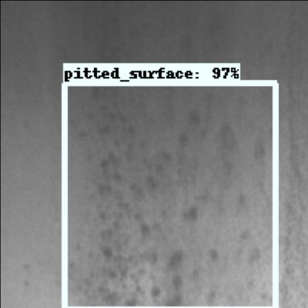

# Deep Learning-based object detection on Embedded Devices

This repository contains the codes and notebooks used for the master thesis written by Bertalan Kovács. 
The final project was made as the part of the Master of Science in Automation and Robot Technology study line at Technical University of Denmark and was carried out in collaboration with ProInvent A/S.

- **Project period:** 1st September 2020 - 1st February 2021 
- **Project ECTS:** 30
- **Advisors:**
    - Lazaros Nalpantidis: _Associate Professor of Robotics, Department of Electrical Engineering, Technical University of Denmark (DTU)_
    - Jonathan Dyssel Stets: _Head of Vision Technology at ProInvent A/S_
    - Anders D. Henriksen: _Computer Vision Developer at ProInvent A/S_

### Thesis abstract
There is a rapidly increasing demand for smart cameras in the industry, however  
the available devices are too expensive, have closed source software running in-  
side and do not contain deep learning capabilities in most of the cases.

The scope of this project is to experiment with various state of-the-art deep  
neural networks and see their inference capability, deployed on different embed-  
ded devices. The goal is to find an efficient network-inference engine-hardware  
combination that can achieve a sufficiently fast and accurate object detection  
on multiple custom datasets with transfer learning. This would pave the way to-  
wards edge computing custom smart cameras with extended machine learning abili-  
ties, focused on object detection.

### Thesis summary
The aim of the thesis was to make deep learning available on low-cost edge devices as an alternative for smart cameras.

A thorough research was made particularly focusing on the history of object detection networks to locate and understand the state-of-the-art models. Edge devices and the potential hardware solutions which are able to deploy deep neural networks were also discovered.
The most promising combinations of the system components were selected which became:

- a **Raspberry Pi 4** with 
- an **Edge TPU accelerator** 
- running **TensorFlow Lite**. 

The selected networks are 

- **MobileNet v2 SSD**, 
- **MobileDet**, 
- **EfficientDet D0**, 
- **Tiny-YOLO v4**, 
- and **YOLO v5s**.

All models were converted to a TFLite format and deployed on the Raspberry Pi to measure their inference time capabilities. After testing multiple inference engines, the TensorFlow Lite framework proved to provide the fastest execution time. It was also observed that MobileNet v2 SSD and MobileDet achieved the fastest running time among all models.

Edge TPU compatible formats were compiled from the quantized four full-integer models. The neural network computations were successfully mapped to the Edge TPU in the case of the two mobile networks, while the YOLO models have a high number of unmappable operations.  
With the four compiled models, the second round of inference tests was completed. The two models with a significant acceleration were the MobileNet v2 SSD and MobileDet networks.

The highest running speed of MobileNet v2 SSDLite reached **65 FPS on the Edge TPU**. The achieved speed clearly demonstrated the power and topicality of the selected system components to run object detection on embedded devices with low latency.

Finally, it prepared two datasets to retrain all networks and compare their flexibility in terms of learning custom data samples. All networks accomplished the training process on two datasets: the Hard Hat Workers and the Surface Defect databases.
The most accurate model performance was achieved by the YOLO v5s model.
It was concluded that only the mobile networks accomplished better results on the data with smaller-size textural features against the COCO-similar dataset.
Generally, the transfer learning gave satisfying results when good annotations were present. It proved the flexible learning capability of all models.

Tiny-YOLO v4 was found as the best model for fast and iterative training. It can be concluded the mobile models having the highest efficiency. Finally, it can be stated that YOLO v5s is the most effective network with an acceptable speed and dynamic input size.

Five state-of-the-art models are deployed and validated via transfer learning on two custom datasets. Suggested alternatives are made to replace the expensive and closed software structured smart cameras, therefore both major goals are satisfied.

# Project structure
The structure of the repository follows the content of the report. There are three major folders which includes the needed scripts/notebooks to reproduce the results within the given section.

1. **Conversion and quantization**: Conversion notebook files to get TensorFlow Lite models.
2. **Inference test**: Scripts to run the local inference time measurements on all relevant hardware (Raspberry Pi, Edge TPU, desktop, laptop, Colab backend).  
3. **Transfer learning**: Notebook files to complete the transfer learning on the two selected datasets: [Hard Hat Workers](https://dataverse.harvard.edu/dataset.xhtml?persistentId=doi:10.7910/DVN/7CBGOS)  and [Surface Defect](http://faculty.neu.edu.cn/yunhyan/NEU_surface_defect_database.html) datasets (both from the Northeastern University).

Detailed description of the folders are given below.

## Conversion and quantization
The folder contains three types of notebooks.

- Files start with *conversion\_* naming complete model conversions from different formats to TensorFlow Lite format.
- Files start with *quant\_* naming complete model quantization to implement different quantization techniques on the models.
- Files start with *TPUquant\_* naming complete full integer quantization and compile the Edge TPU compatible model.

## Inference tests
The folder contains two further folder: 

- _**config**_: It includes several _.csv_ files containing Google Drive IDs which are used to download pretrained models, images and label files.
- _**results**_: Contains result files: saved running times, output predictions.

The folder also contains different scripts:

- _**dnn\_inference.py**_: Runs inference with the OpenCV DNN module as inference engine.
- _**downloads.py**_: Downloads all models and test images for the inference tests. 
- _**process\_results.py**_: Process the inference time results. Calculates and average of the test samples excluding the firt run. It saves the processed average times with plots as a potential option.
- _**tf\_inference.py**_: Runs inference with the default TensorFlow as inference engine.
- _**tflite\_inference**_.py_: Runs inference with TensorFLow Lite as inference engine on all the models and quantized variants.
- _**tflite\_utils.py**_: Util functions for the _tflite\_inference_.py_ script.

## Transfer learning
The folder contains four folders:

- _**data**_: It includes the _.csv_ file containing Google Drive IDs which are used to download prepared datasets. It also contains the notebook used to prepare all input formats for the different training frameworks.
- _**example\_prediction**_: Contains the visualized example outputs below.
- _**hard\_hat\_training**_: Contains all notebooks for traning the five (+ extra) models on the Hard Hat Workers dataset.
- _**surface\_defect\_training**_: Contains all notebooks for traning the five models on the Surface Defect dataset.

Example predictions on the Hard Hat Workers dataset:

|  Example of _helmet_ prediction |  Example of _helmet_ prediction | Example of _head_ prediction
:-------------------------:|:-------------------------:|:-------------------------:
  |   |  

Example predictions on the Surface Defect database:

Example of _patches_ defect prediction  |  Example of _rolled-in scale_ defect prediction  |  Example of _pitted surface_ defect prediction
:---:|:---:|:---:
 |  |  
